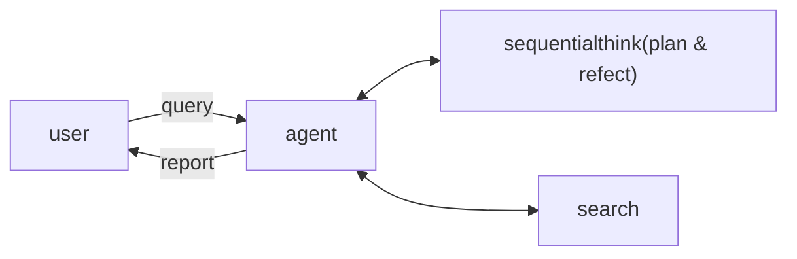
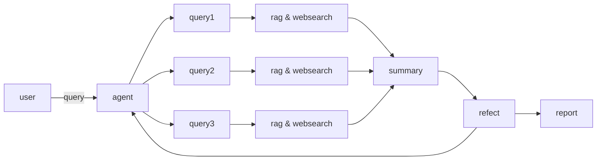

# gemini-researcher

## Architecture

```mermaid
flowchart LR
  user --query--> agent
  agent <--> st["sequentialthink(plan & refect)"]
  agent <--> search
  agent --report--> user

```

```mermaid
flowchart LR
  user --query--> agent
  agent --> query1
  agent --> query2
  agent --> query3
  query1 --> s1[rag & websearch]
  query2 --> s2[rag & websearch]
  query3 --> s3[rag & websearch]
  s1 --> summary
  s2 --> summary
  s3 --> summary
  summary --> refect
  refect --> report
  refect --> agent
  

  


```

